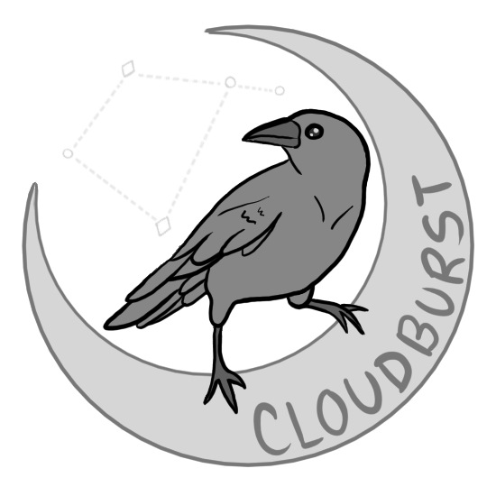

# <a href="https://corvus.rip"></a> wemod-shortener
URL Shortener for WeMod.

<br>

## Getting Started

Clone this repository from github by calling either of the below options:

```
git clone git@github.com:CorvusCloudburst/wemod-shortener.git
``` 
```
git clone https://github.com/CorvusCloudburst/wemod-shortener.git
```

Then `cd` into the newly created `wemod-shortener` folder.

### Setting up your environment

Run:
```
make init
```

This should hopefully handle most of the setup. I tested it on two Macs and a Debian 12. If your conditions vary too greatly from that then congratulations, you're now my honorary QA team. In a kinder world I would have used Docker, but alas, life is a cruel mistress and I did not.

This application requires PHP 8.4 and [composer](https://getcomposer.org/). If you do not have these, you may be directed to install them before retrying `make init`.

If you're hitting errors while getting set up, I recommend stepping through steps listed in the `init` flow of the [Makefile](./Makefile).

### Running the application locally

In the root directory of this project, run:
```
composer run dev
```

The application should now be accessible at http://localhost:8000.

Feel free to make a new account if you wish! However, there is an example account already set up and seeded for you to explore. The credentials are:

**Email:** `meep@moop.mop`

**Password:** `password`

There is a [sample csv](./tests/sample.csv) provided as well.

<br>

## Navigating the Repository

A great starting point for getting oriented is [web.php](./routes/web.php). This file contains all of the relevant API and Page routes.

From there, I recommend taking a look at [ShortUrlController.php](./app/Http/Controllers/ShortUrlController.php). This is where all of the non-boilerplate routing calls are handled.

Frontend routes use Inertia as a middleman for the React frontend. The relevant React components can be found in [the pages folder](./resources/js/Pages/Homepage.jsx).

Everything related to authentication is boilerplate provided by Laravel Breeze. I assumed that "authentication not required" meant it was "not required but allowed." I found it easier to just leave the boilerplate authentication in place and make use of it rather than remove it.

<br>

## Data Model

The Users / authentication tables were auto-generated using Laravel Breeze so I won't bother to list them here.

### ShortUrls
| Name | Type | Description |
| ---- | ---- | ----------- |
| id   | integer | auto-incremented primary key |
| user | foreign id | the creator of the link |
| original_url | string | the url to redirect to |
| short_url_path | string | the short path that will redirect to the original_url* |
| created_at | timestamp | auto-generated timestamp |
| updated_at | timestamp | auto-generated timestamp |

\* *I found it more graceful in this column to only store the short 5-digit path, rather than the entire url. This way, a domain change will not require a massive database migration, and the values themselves will be a bit smaller.*

### UrlVisits
| Name | Type | Description |
| ---- | ---- | ----------- |
| id   | integer | auto-incremented primary key |
| short_url_id | foreign id | the url being visited |
| ip | string | The IP address of the visitor |
| created_at | timestamp | auto-generated timestamp--useful for capturing visit time |
| updated_at | timestamp | auto-generated timestamp |

<br>

## Useful Guides
- [Laravel Inertia Bootcamp](https://bootcamp.laravel.com/inertia/installation)
- [Laravel Pizza Tracker Tutorial](https://www.youtube.com/watch?v=hWFP9DeB7KA&t=1637s)

<br><br>


## Given Requirements

**Backend Take Home Challenge**

Let us pretend we are a brand-new startup with a simple mission, providing shortened URLs for enterprise companies. Below you will find our product requirements and technical specifications. Do your best to meet all requirements and document any assumptions made. This is the main code assessment in the WeMod interview process, so be sure to be proud of both the functionality and design of the code you submit.

**Product Requirements**

- Users should be able to upload a batch of Long URLs to be shortened via a CSV file.
- Short URLs should redirect the user to the Long URL destination.
- Each visit to a Short URL should be tracked for analytics.
- An endpoint to retrieve data about the Short URL, like the visit analytics.

**Technical Specifications**

- Provide documentation that explains how to run the provided code and access the service in a local development environment.
- Code should be clean, concise, and self-documenting.
- PHP should be used; version 8.2 or greater.
- The latest version of either Laravel or Symfony should be utilized.
- Use the framework and language features to write well engineered code
- Data should be persisted in a relational database.
- Proper authentication is not required.


<br><br><br><br><br>
<br><br><br><br><br>

---

<p align="center"><a href="https://laravel.com" target="_blank"></a></p>

<p align="center">
<a href="https://github.com/laravel/framework/actions"></a>
<a href="https://packagist.org/packages/laravel/framework"></a>
<a href="https://packagist.org/packages/laravel/framework"></a>
<a href="https://packagist.org/packages/laravel/framework"></a>
</p>

## About Laravel

Laravel is a web application framework with expressive, elegant syntax. We believe development must be an enjoyable and creative experience to be truly fulfilling. Laravel takes the pain out of development by easing common tasks used in many web projects, such as:

- [Simple, fast routing engine](https://laravel.com/docs/routing).
- [Powerful dependency injection container](https://laravel.com/docs/container).
- Multiple back-ends for [session](https://laravel.com/docs/session) and [cache](https://laravel.com/docs/cache) storage.
- Expressive, intuitive [database ORM](https://laravel.com/docs/eloquent).
- Database agnostic [schema migrations](https://laravel.com/docs/migrations).
- [Robust background job processing](https://laravel.com/docs/queues).
- [Real-time event broadcasting](https://laravel.com/docs/broadcasting).

Laravel is accessible, powerful, and provides tools required for large, robust applications.

## Learning Laravel

Laravel has the most extensive and thorough [documentation](https://laravel.com/docs) and video tutorial library of all modern web application frameworks, making it a breeze to get started with the framework.

You may also try the [Laravel Bootcamp](https://bootcamp.laravel.com), where you will be guided through building a modern Laravel application from scratch.

If you don't feel like reading, [Laracasts](https://laracasts.com) can help. Laracasts contains thousands of video tutorials on a range of topics including Laravel, modern PHP, unit testing, and JavaScript. Boost your skills by digging into our comprehensive video library.

## Laravel Sponsors

We would like to extend our thanks to the following sponsors for funding Laravel development. If you are interested in becoming a sponsor, please visit the [Laravel Partners program](https://partners.laravel.com).

### Premium Partners

- **[Vehikl](https://vehikl.com/)**
- **[Tighten Co.](https://tighten.co)**
- **[WebReinvent](https://webreinvent.com/)**
- **[Kirschbaum Development Group](https://kirschbaumdevelopment.com)**
- **[64 Robots](https://64robots.com)**
- **[Curotec](https://www.curotec.com/services/technologies/laravel/)**
- **[Cyber-Duck](https://cyber-duck.co.uk)**
- **[DevSquad](https://devsquad.com/hire-laravel-developers)**
- **[Jump24](https://jump24.co.uk)**
- **[Redberry](https://redberry.international/laravel/)**
- **[Active Logic](https://activelogic.com)**
- **[byte5](https://byte5.de)**
- **[OP.GG](https://op.gg)**

## Contributing

Thank you for considering contributing to the Laravel framework! The contribution guide can be found in the [Laravel documentation](https://laravel.com/docs/contributions).

## Code of Conduct

In order to ensure that the Laravel community is welcoming to all, please review and abide by the [Code of Conduct](https://laravel.com/docs/contributions#code-of-conduct).

## Security Vulnerabilities

If you discover a security vulnerability within Laravel, please send an e-mail to Taylor Otwell via [taylor@laravel.com](mailto:taylor@laravel.com). All security vulnerabilities will be promptly addressed.

## License

The Laravel framework is open-sourced software licensed under the [MIT license](https://opensource.org/licenses/MIT).
